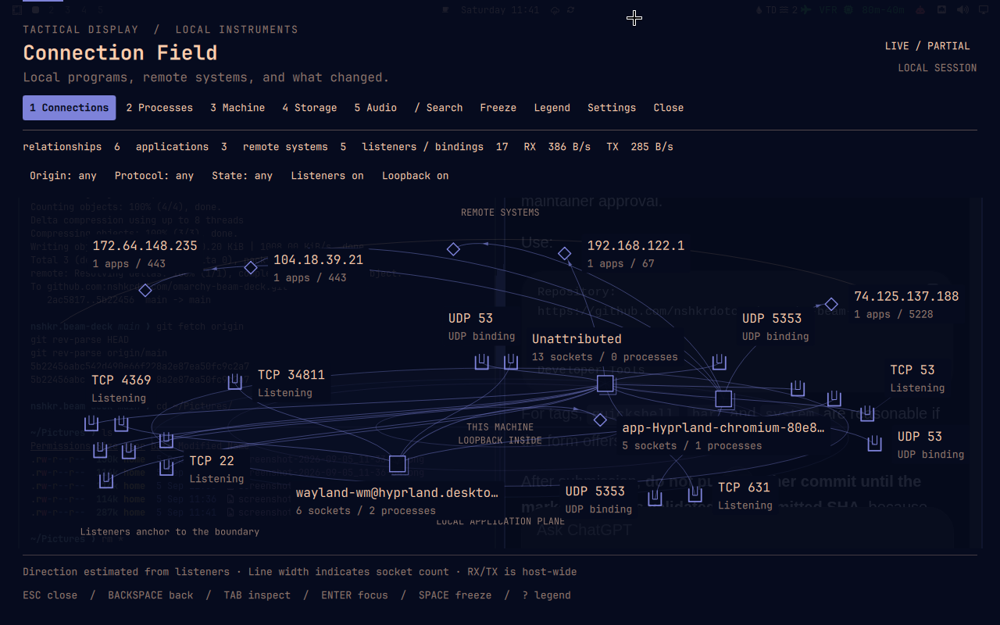

# Tactical Display

[](https://github.com/nshkrdotcom/omarchy-tactical-display)
[](LICENSE)
[](https://github.com/nshkrdotcom/omarchy-tactical-display)

**Real-time system instrumentation and visual diagnostics for Omarchy Quattro.**

Tactical Display is a fullscreen, keyboard-first observability overlay for Omarchy. It presents the machine as relationships rather than a conventional meter dashboard: network connections, process ancestry, machine pressure, storage topology, and PipeWire routing share one visual and inspection model.



## Features

### Five Instruments

Switch between instruments at any time by pressing `1` through `5`:

| # | Instrument | What You See |
|---|---|---|
| `1` | **Connection Field** | Active network relationships between local applications, remote endpoints, loopback traffic, and visible listeners. |
| `2` | **Process Topology** | Interactive process ancestry and application groups, with CPU, memory, thread, network, and I/O emphasis. |
| `3` | **Machine Anatomy** | CPU, memory, storage, network, optional GPU/thermal state, Linux PSI, contributors, and rolling trends. |
| `4` | **Storage / I/O Flow** | Process I/O beside mount, partition, device-mapper, and block-device topology. FD-to-mount links are structural and are not presented as per-mount byte attribution. |
| `5` | **Audio Routing** | Live PipeWire streams, devices, nodes, and measured routes, with explicitly enabled/confirmed mute and default-device actions. |

### Highlights

- **Ephemeral collection**: the telemetry helper runs only while the overlay is open and is terminated on dismissal.
- **Screen-share privacy mode**: `P` masks process/network identity and uses an opaque presentation.
- **Snapshot freeze**: `Space` captures a stable inspection snapshot while collection continues behind it.
- **Theme adaptive**: colors and contrast derive from the active Omarchy theme.
- **Unprivileged and local-first**: core providers read user-accessible `/proc`, sysfs, and local desktop services. No packet capture, privileged daemon, cloud analytics, or required root access.
- **Resource-contained by design**: collection uses absolute/global work budgets, canonical socket-detail storage, demand-scoped per-process network topology, generation-pinned freeze, constructively bounded transport, adaptive sampling backoff, and supervised helper recovery.

## Requirements and External Dependencies

### Required runtime

- **Omarchy Quattro 4.0.1+** on Wayland/Hyprland/Quickshell.
- **Python 3.10+**. Core telemetry uses the Python standard library only.

### Optional runtime capabilities

- **PipeWire / WirePlumber**: `pw-dump` provides the audio graph; `wpctl` is required only for the opt-in mute/default actions.
- **NVIDIA utilities**: `nvidia-smi` is an optional GPU telemetry fallback when suitable sysfs data is unavailable. It is never installed by this plugin.
- **Offline network enrichment**: a user-supplied local MMDB can be enabled with `tdOfflineDb`; this optional path requires the Python `maxminddb` module. Tactical Display does not download a database or Python package.
- **Reverse DNS**: disabled by default. Selecting DNS naming uses the system resolver and may generate normal resolver network traffic.

### Development only

- **Node.js** is used for the JavaScript model/layout test suite and fixture renderer; it is not required by the live plugin.

No `sudo` or `pkexec` is required. The repository contains no package-manager bootstrap, install hook, bundled executable binary, systemd service, or automatic remote build.

## Install

Install and enable Tactical Display directly from its public Git repository:

```bash
omarchy plugin add https://github.com/nshkrdotcom/omarchy-tactical-display.git --enable
```

If you already have a local Git checkout, Omarchy also accepts the checkout path:

```bash
cd /path/to/omarchy-tactical-display
omarchy plugin add "$PWD" --enable
```

The compact bar widget declares the right section as its default. To place or move it explicitly:

```bash
omarchy bar put nshkr.tactical-display
omarchy bar move nshkr.tactical-display --section right --index 0
```

- **Left-click**: toggle Tactical Display on the focused monitor.
- **Right-click**: open the instrument picker.

### Update

Git-managed installations use Omarchy's normal update path:

```bash
omarchy plugin update nshkr.tactical-display
```

### Remove

```bash
omarchy plugin remove nshkr.tactical-display
```

Tactical Display does not install a privileged helper, persistent host service, or external database. Removing the plugin removes its Omarchy checkout/config entry; a user-supplied offline MMDB remains wherever the user placed it.

## Usage

### Keyboard Controls and Navigation

Tactical Display is a fullscreen Omarchy `overlay`, so its bare-key map is active only while the overlay owns keyboard focus. It does **not** reuse Omarchy's bar-panel key catcher: panel conventions reserve keys such as `H/J/K/L`, `Space`, and `X` for generic list movement/actions, while those keys have deliberate instrument semantics here. Omarchy's global `Super+Ctrl+1-9` bar-panel bindings are separate from Tactical Display's local bare `1-5`.

| Key | Action |
|---|---|
| `1` – `5` | Switch directly between instruments |
| `I` | Open/close the instrument picker; arrows navigate and `Enter` selects |
| `Tab` / `Shift+Tab` | Cycle through nodes and entities |
| `Arrow Keys` | Move selection through visible entities |
| `Enter` | Focus the selected entity |
| `X` | Expand / collapse application groups into individual process instances |
| `F` | Isolate selected entity and its direct connections |
| `Space` | Freeze / resume the inspection snapshot |
| `/` | Search processes, PIDs, ports, hosts, mounts, and audio streams |
| `P` | Toggle screen-share privacy mode |
| `?` / `H` | Open the legend and keyboard guide |
| `,` | Open settings |
| `C` | Copy selected entity details to the clipboard |
| `Backspace` | Step back one navigation level |
| `R` | Reset the current view |
| `Escape` | Dismiss immediately |
| `F6` | Toggle focus between the visualization and controls |

Instrument-specific controls are listed in the in-app legend. Notable shortcuts include `V` for connection/storage/audio lenses, `E` for process emphasis, `T` for machine trends, and `L`/`O` for Connection Field listener/loopback visibility.

When Search has focus, normal text-editing behavior wins: modifier chords such as `Ctrl+A/C/V` are left to the `TextField`, while unmodified `Up`/`Down` move through results and `Enter` focuses the result. `F6` moves keyboard focus into the native controls, where `Tab`/`Shift+Tab`, `Enter`, and `Space` follow normal Qt control behavior; `F6` returns to field navigation. Mouse-focused controls are detected from Qt's active focus item so field shortcuts cannot leak through a focused button. `Escape` remains the one-stroke emergency dismissal from every overlay state.

### Optional global bindings

Tactical Display does not install compositor bindings. To print the reviewed Omarchy Quattro Lua example for `Super+F10` toggle and `Super+F11` press-and-hold:

```bash
omarchy menu keybindings --print   # inspect your effective bindings first
make bindings                      # print only; does not edit configuration
```

Add the printed block to `~/.config/hypr/bindings.lua` only after checking for collisions. If you intentionally replace an existing Omarchy binding, unbind that default explicitly first; the generated Tactical Display block never unbinds user or Omarchy keys on your behalf.

## Configuration

Open Settings with `,` to configure the default instrument, refresh profile, animation level, label density, endpoint naming, privacy, bar presentation, and optional audio actions. Configuration is merged through Omarchy's native plugin settings API; Tactical Display does not rewrite `shell.json` wholesale.

See the [Configuration Reference](docs/CONFIGURATION.md) for the complete native settings contract.

## Security and Privacy

Tactical Display is local-first and unprivileged. Its core providers read user-accessible `/proc`, sysfs, and local desktop services; it does not require packet capture, a privileged daemon, cloud analytics, `sudo`, or `pkexec`. Screen-share privacy mode masks process/network identity in the presentation, while optional DNS and offline-MMDB enrichment remain explicit capabilities. Expensive scans, internal detail retention, transport size and helper recovery are bounded so the observer backs off rather than compounding host pressure.

See [Security and Privacy](docs/SECURITY-PRIVACY.md) for the full threat model, data-handling boundaries, and optional-action behavior.

## Development and Testing

Run the local test and validation suite:

```bash
make test
bash scripts/doctor.sh
bash scripts/validate.sh
python3 scripts/release-gate.py --source-only
```

On an Omarchy workstation, run the native release gates as well:

```bash
bash scripts/validate.sh --require-native
omarchy plugin validate .
```

See [Testing](docs/TESTING.md) for automated and real-host checks.

## Documentation

- [Architecture and Design](docs/ARCHITECTURE.md)
- [Data Model and Schemas](docs/DATA-MODEL.md)
- [Configuration Reference](docs/CONFIGURATION.md)
- [Security and Privacy](docs/SECURITY-PRIVACY.md)
- [Visual System and Canvas Renderer](docs/VISUAL-DESIGN.md)
- [Testing Guide](docs/TESTING.md)
- [Omarchy Runtime Contract](docs/UPSTREAM-CONTRACT.md)

## License

Tactical Display is open-source software licensed under the [MIT License](LICENSE).